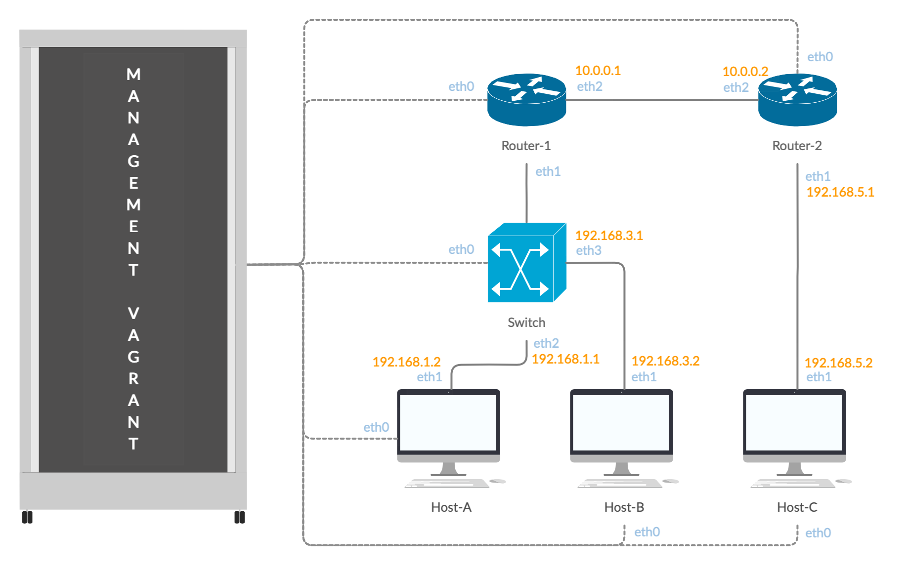

# DNCS-LAB

This repository contains the Vagrant files required to run the virtual lab environment used in the DNCS course.
```


        +-----------------------------------------------------+
        |                                                     |
        |                                                     |eth0
        +--+--+                +------------+             +------------+
        |     |                |            |             |            |
        |     |            eth0|            |eth2     eth2|            |
        |     +----------------+  router-1  +-------------+  router-2  |
        |     |                |            |             |            |
        |     |                |            |             |            |
        |  M  |                +------------+             +------------+
        |  A  |                      |eth1                       |eth1
        |  N  |                      |                           |
        |  A  |                      |                           |
        |  G  |                      |                     +-----+----+
        |  E  |                      |eth1                 |          |
        |  M  |            +-------------------+           |          |
        |  E  |        eth0|                   |           |  host-c  |
        |  N  +------------+      SWITCH       |           |          |
        |  T  |            |                   |           |          |
        |     |            +-------------------+           +----------+
        |  V  |               |eth2         |eth3                |eth0
        |  A  |               |             |                    |
        |  G  |               |             |                    |
        |  R  |               |eth1         |eth1                |
        |  A  |        +----------+     +----------+             |
        |  N  |        |          |     |          |             |
        |  T  |    eth0|          |     |          |             |
        |     +--------+  host-a  |     |  host-b  |             |
        |     |        |          |     |          |             |
        |     |        |          |     |          |             |
        ++-+--+        +----------+     +----------+             |
        | |                              |eth0                   |
        | |                              |                       |
        | +------------------------------+                       |
        |                                                        |
        |                                                        |
        +--------------------------------------------------------+


```

# Requirements
 - Python 3
 - 10GB disk storage
 - 2GB free RAM
 - Virtualbox
 - Vagrant (https://www.vagrantup.com)
 - Internet

# How-to
 - Install Virtualbox and Vagrant
 - Clone this repository
`git clone https://github.com/fabrizio-granelli/dncs-lab`
 - You should be able to launch the lab from within the cloned repo folder.
```
cd dncs-lab
[~/dncs-lab] vagrant up
```
Once you launch the vagrant script, it may take a while for the entire topology to become available.
 - Verify the status of the 4 VMs
 ```
 [dncs-lab]$ vagrant status                                                                                                                                                                
Current machine states:

router                    running (virtualbox)
switch                    running (virtualbox)
host-a                    running (virtualbox)
host-b                    running (virtualbox)
 ```
- Once all the VMs are running verify you can log into all of them:
`vagrant ssh router`
`vagrant ssh switch`
`vagrant ssh host-a`
`vagrant ssh host-b`
`vagrant ssh host-c`

# Assignment
This section describes the assignment, its requirements and the tasks the student has to complete.
The assignment consists in a simple piece of design work that students have to carry out to satisfy the requirements described below.
The assignment deliverable consists of a Github repository containing:
- the code necessary for the infrastructure to be replicated and instantiated
- an updated README.md file where design decisions and experimental results are illustrated
- an updated answers.yml file containing the details of your project

## Design Requirements
- Hosts 1-a and 1-b are in two subnets (*Hosts-A* and *Hosts-B*) that must be able to scale up to respectively 373 and 302 usable addresses
- Host 2-c is in a subnet (*Hub*) that needs to accommodate up to 50 usable addresses
- Host 2-c must run a docker image (dustnic82/nginx-test) which implements a web-server that must be reachable from Host-1-a and Host-1-b
- No dynamic routing can be used
- Routes must be as generic as possible
- The lab setup must be portable and executed just by launching the `vagrant up` command

## Tasks
- Fork the Github repository: https://github.com/fabrizio-granelli/dncs-lab
- Clone the repository
- Run the initiator script (dncs-init). The script generates a custom `answers.yml` file and updates the Readme.md file with specific details automatically generated by the script itself.
  This can be done just once in case the work is being carried out by a group of (<=2) engineers, using the name of the 'squad lead'. 
- Implement the design by integrating the necessary commands into the VM startup scripts (create more if necessary)
- Modify the Vagrantfile (if necessary)
- Document the design by expanding this readme file
- Fill the `answers.yml` file where required (make sure that is committed and pushed to your repository)
- Commit the changes and push to your own repository
- Notify the examiner (fabrizio.granelli@unitn.it) that work is complete specifying the Github repository, First Name, Last Name and Matriculation number. This needs to happen at least 7 days prior an exam registration date.

# Notes and References
- https://rogerdudler.github.io/git-guide/
- http://therandomsecurityguy.com/openvswitch-cheat-sheet/
- https://www.cyberciti.biz/faq/howto-linux-configuring-default-route-with-ipcommand/
- https://www.vagrantup.com/intro/getting-started/

# Team 👥

This project was done by Baccichet Giovanni (`202869`) and Parpinello Davide (`201494` - team leader).

# Design 💡
We started by executing the dcns-init script, that returned us the different values that need to be the number of scalable hosts in the subnets:

- Subnet (host-a): 373 hosts;
- Subnet  (host-b): 302 hosts;
- Subnet (host-c): 50 hosts.

### Subnets 📡

Considering the design requirements, we decided to create 4 subnets. Doing some math, we calculated the most efficient way to organise the IP addresses:

1. **Subnet 1** is between router-1 and router-2. We used private class-a addresses with the subnet `10.0.0.0/30` to cover only the 2 routers (2<sup>32-30</sup>-2=2);
2. **Subnet 2** is between router-1 and host-a, and according to the design requirements it has a max number of host of 373. We used private class-c addresses for this subnet `192.168.1.0/23` (2<sup>32-23</sup>-2 = 510>373);
3. **Subnet 3** is between router-1 and host-b. We used private class-c addresses with the subnet `192.168.3.0/23` to cover the 302 hosts (2<sup>32-23</sup>-2=510>302);
4. **Subnet 4** is between router-2 and host-c. We used private class-c addresses with the subnet `192.168.5.0/26` to cover the 50 hosts (2<sup>32-26</sup>-2=62>50).

### VLANs and IP configurations 💾



| Device   | Interface predictable name | Interface | IP          | Subnet |
| -------- | -------------------------- | --------- | ----------- | ------ |
| Router-1 | enp0s9                     | eth2      | 10.0.0.1    | 1      |
| Router-2 | enp0s9                     | eth2      | 10.0.0.2    | 1      |
| Router-1 | enp0s8                     | eth1      | 192.168.1.1 | 2      |
| Host-A   | enp0s8                     | eth1      | 192.168.1.2 | 2      |
| Router-1 | enp0s8                     | eth1      | 192.168.3.1 | 3      |
| Host-B   | enp0s8                     | eth1      | 192.168.3.2 | 3      |
| Router-2 | enp0s8                     | eth1      | 192.168.5.1 | 4      |
| Host-C   | enp0s8                     | eth1      | 192.168.5.2 | 4      |

We then proceeded to create 2 VLANs, respectively for the subnets 2 and 3 with Tag `10` and `30`.

# Vagrant configuration 🖥

We included all the commands needed for the configuration of the network in a bash script for each of the devices. Those scripts will configure the network during the creation of the VMs, after the command `vagrant up`. These scripts are included in the `Vagrantfile` using the `provision` command. We also needed to increase the memory of `host-c` from 256 to 512 (MB), otherwise it would have been impossible to pull and run the Docker image; in order to do that we modified the option `vb.memory`.

## Commands used 🔧

Since the newer Debian-based distros use predictable names for network interfaces, we had to check what interfaces corresponded to `eth1`, `eth2` and `eth3`, to match the specifications given.
We used the command `dmesg | grep -i eth` and put the results in the table above. Every other command from now has to be executed by the superuser (adding `sudo` before the command).
- [**IP**] We then proceeded assigning an IP address to each interface, with the command `ip addr add [IP_ADDR] dev [INTERFACE]`, then activating said interface with `ip link set dev [INTERFACE] up`;
- [**FORWARDING**] Then we enabled the IPv4 forwarding in the routers with `sysctl -w net.ipv4.ip_forward=1`; 
- [**VLAN**] For creating the VLANs mentioned earlier, we used `ip link add link enp0s8 name enp0s8.10 type vlan id 10` and `ip link add link enp0s8 name enp0s8.30 type vlan id 30` and added IP addresses to the virtual interfaces with `addr add 192.168.1.1/23 dev enp0s8.10` and `ip addr add 192.168.3.1/23 dev enp0s8.30`;
- [**ROUTE**] To create a route we used the `ip route add 192.168.5.0/26 via 10.0.0.2` command. The first parameter `192.168.5.0/26` corresponds to the network we want to reach, and after `via` there is the IP address of the next hop, that is the interface of the router placed in the subnet where the current host is. Every host that has to reach another subnet has specific routes that achieve this, but, in particular, some hosts have generic routes with destinations like `192.168.0.0/23`, with the purpose of designing the routes as generic as possible, covering the range `192.168.0.0 - 192.168.5.255`, that includes all of our host subnets.

## Switch configuration 🔀

We then had to setup the switch, assigning the VLAN tags to the ports. We created a bridge named “switch” with `ovs-vsctl add-br switch`.
Then we configured the ports:
```
ovs-vsctl add-port switch enp0s8
ovs-vsctl add-port switch enp0s9 tag="10"
ovs-vsctl add-port switch enp0s10 tag="30"
```
## Host C configuration 🕸

Since one design requirement was for the Host C to run a docker image, we proceeded with its configuration:
```
apt-get update
apt-get -y install docker.io
systemctl start docker
systemctl enable docker
docker pull dustnic82/nginx-test
docker run --name nginx -p 80:80 -d dustnic82/nginx-test
```
To check if the Host C was reachable from the Host A and the Host B we executed from every one of them `curl 192.168.5.2`, resulting in the following output:
```
<!DOCTYPE html>
<html>
<head>
<title>Hello World</title>
<link href="data:image/png;base64,iVBORw0KGgoAAAANSUhEUgAAAEAAAABACAYAAACqaXHeAAAGPElEQVR42u1bDUyUdRj/iwpolMlcbZqtXFnNsuSCez/OIMg1V7SFONuaU8P1MWy1lcPUyhK1uVbKcXfvy6GikTGKCmpEyoejJipouUBcgsinhwUKKKJ8PD3vnzsxuLv35Q644+Ue9mwH3P3f5/d7n6/3/3+OEJ/4xCc+8YQYtQuJwB0kIp+JrzUTB7iJuweBf4baTlJ5oCqw11C/JHp+tnqBb1ngT4z8WgReTUGbWCBGq0qvKRFcHf4eT/ZFBKoLvMBGIbhiYkaQIjcAfLAK+D8z9YhjxMgsVUGc84+gyx9AYD0khXcMfLCmUBL68HMZ+PnHxyFw3Uwi8B8hgJYh7j4c7c8PV5CEbUTUzBoHcU78iIl/FYFXWmPaNeC3q4mz5YcqJPI1JGKql2Z3hkcjD5EUznmcu6qiNT+Y2CPEoH3Wm4A/QERWQFe9QQ0caeCDlSZJrht1HxG0D3sOuCEiCA1aj4ZY3Ipzl8LiVtn8hxi5zRgWM8YYPBODF/9zxOLcVRVs+YGtwFzxCs1Bo9y+avBiOTQeUzwI3F5+kOwxsXkkmWNHHrjUokqtqtSyysW5gUHV4mtmZEHSdRkl+aELvcFIRN397gPPXD4ZgbxJW1S5OJdA60MgUAyHu1KfAz+pfCUtwr+HuQc8ORQ1jK4ZgGsTvcY5uQP5oYkY2HfcK5sGLpS6l1xZQwNn7Xkedp3OgMrWC1DX0Qwnms/A1rK9cF9atNVo18DP/3o5fF99BGo7LFDRWgMJJQaYQv/PyOcHySP0TITrBIhYb+WSHLrlNGEx5NeXgj2paW8C5rs46h3Dc3kt3G2Ogr9aqoes+f5RvbL1aJ5iXnKnxkfIEoB3N/zHeHAmF9ovwryvYvC9TysnICkEonPX212vvOU8+As6eS+QCDAw0aNLABq6LO8DkJMSSznMMEfScFFGwCJYXbDV7lq17RYIQu+QTYpjRUBM3gZQIt+cOwyTpWRpYBQRsKrgU4ceNS4JkCSxLI1+ZsIS0NvXB6sLE/tL5EQkQJKOm52YON9y7glqJkCSOqzrD6Uvc1wZ1EBA07V/IafmN4ckHG+ugJkSEHuVQQ0ENFy9BLP3R0NR4ymHJGRWFWBnZ6fPVwMBF9EDgrD2z0USqtoaHJKw49SBoZ2dWggIxmcEsvspYLLi4PKNDrvv68OfuKLt/68MqiJAan4Q0IpDm6G7r8fue692X4fI7PiByqA6AqygNh0XHIaClDOkpz9aGVRJABo8CTP+3sqfHZJQeqkSgvHZn+xaqEICKAlhECSGO60MWdVF4IcesDL/ExUSYN3okCrD31fqHZLwcWkq5owPVUoA3UcIgdBv10BrV7vdz3b39kBhw0kVE2BNirG/bqRghyPqIcBKQkKJcVgE1LQ1wR3S5ooqCDBKlSEUzGdyFBNwvq1RTQT0b4BOF5+BgoayCUqAtTLMSXsRzl6uHX8EONoUtXS2KCfAusOsyVwFLV1tznNAuzflAGxb+R/esGuodDcD0bUVbYLelhRf/mWD08ogdYtTjNwYbIsrORhBIwJMPOTWHh1i6Lriz107FUKviivcZvfp8WZvN8TmbVS2rtsHI8mMtn9gSe50KAz79yWw8490OGYpp8lsTUGictd3EA6PHVwB20+mYUNURo/aMs4dhqjsdcoOWGxH5yYu0g0P0EzFBd7DxZoVHY7aHmWtB6VunwhLB6P0gFULk6zhJnvnBw5HW9D9N5GkpQEjMBcQOg+JMBNxjMZgHISawvGZHiKw+0mybv5ozP0txgvk07AQvWxAoh98sXsur3RmwMStxIud9fiIzMAIXTV6yNqxHaH7gg1GA7bgxVvHfEjq1hAl10ZM/A46gO0x0bOPoiHpSEDvsMZhXVVbVRL4TLz2E140EK1dgsnnd9mBaHcmwuigJHeCGLkXvHNaNHOBP4J/HYmoGbGwsJU1ka0nAvM2ht40758ZNmvvRRJ24l3roMa7MxVq4jpRdyMRc8bh9wR0TyIRWdR9hzNXaJs3Ftif6KDWuBcBH0hErky2bNraV5E9jcBjiapE1ExHkO8iEY1OvjLTjAkugezh7ySqFUPoXHTtZAR7ncY4rRrYYgtcCtGHPUgmjEhPmiKXjXc/l4g6HfGJT3ziEw/If86JzB/YMku9AAAAAElFTkSuQmCC" rel="icon" type="image/png" />
<style>
body {
  margin: 0px;
  font: 20px 'RobotoRegular', Arial, sans-serif;
  font-weight: 100;
  height: 100%;
  color: #0f1419;
}
div.info {
  display: table;
  background: #e8eaec;
  padding: 20px 20px 20px 20px;
  border: 1px dashed black;
  border-radius: 10px;
  margin: 0px auto auto auto;
}
div.info p {
    display: table-row;
    margin: 5px auto auto auto;
}
div.info p span {
    display: table-cell;
    padding: 10px;
}
img {
    width: 176px;
    margin: 36px auto 36px auto;
    display:block;
}
div.smaller p span {
    color: #3D5266;
}
h1, h2 {
  font-weight: 100;
}
div.check {
    padding: 0px 0px 0px 0px;
    display: table;
    margin: 36px auto auto auto;
    font: 12px 'RobotoRegular', Arial, sans-serif;
}
#footer {
    position: fixed;
    bottom: 36px;
    width: 100%;
}
#center {
    width: 400px;
    margin: 0 auto;
    font: 12px Courier;
}

</style>
<script>
var ref;
function checkRefresh(){
    if (document.cookie == "refresh=1") {
        document.getElementById("check").checked = true;
        ref = setTimeout(function(){location.reload();}, 1000);
    } else {
    }
}
function changeCookie() {
    if (document.getElementById("check").checked) {
        document.cookie = "refresh=1";
        ref = setTimeout(function(){location.reload();}, 1000);
    } else {
        document.cookie = "refresh=0";
        clearTimeout(ref);
    }
}
</script>
</head>
<body onload="checkRefresh();">

<div class="info">
<p><span>Server&nbsp;address:</span> <span>172.17.0.2:80</span></p>
<p><span>Server&nbsp;name:</span> <span>94517f31a525</span></p>
<p class="smaller"><span>Date:</span> <span>18/Nov/2020:20:41:38 +0000</span></p>
<p class="smaller"><span>URI:</span> <span>/</span></p>
</div>
<br>
<div class="info">
    <p class="smaller"><span>Host:</span> <span>192.168.5.2</span></p>
    <p class="smaller"><span>X-Forwarded-For:</span> <span></span></p>
</div>

<div class="check"><input type="checkbox" id="check" onchange="changeCookie()"> Auto Refresh</div>
    <div id="footer">
        <div id="center" align="center">
            Request ID: 14dcea7ac763ad5816ec0bd11edf21df<br/>
            &copy; NGINX, Inc. 2018
        </div>
    </div>
</body>
</html>
```
The output was correct.